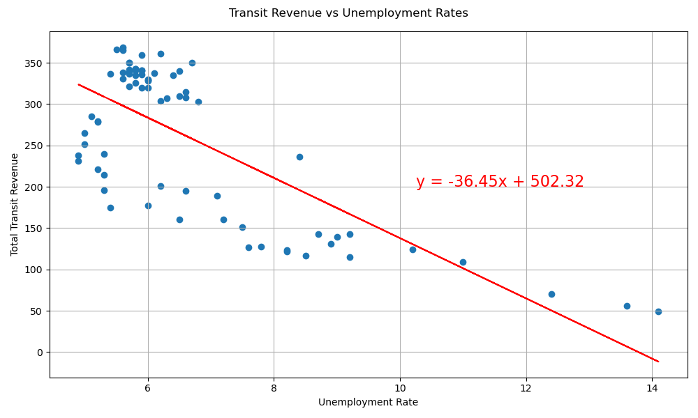

# Project title: Canadian Unemployment Rate Analysis

## Introduction

Team 2's first project is to analyze unemployment and conclude its impact on various economic and social factors. The goal is to prepare a report that Government agencies, Policy makers, and Business leaders can review to make inform decisions as to how unemployment rates correlate to various sectors.

Using data collected from Statistics Canada, we will merge and manipulate data to generate tables and figures needed to visualize and interpret relationships between the data.

We will be using data on:
- Unemployment ~ Data of population and labour force categorized by age groups and geographical locations. 
- Household Spending ~ Data of average household spending by spending categories and geographical locations.
- Immigration ~ Data of immigration categorized by age, gender, type of migrants and geographical locations.
- Public Transit ~ Data on total transit revenue and passengers categorized by geographical locations and age groups.

## Going about the challenge
This project relied heavily on reading in csv files frm stats Canada to obtain data for manipulating and creating graphs and calculating various statistics. Pandas, mathplotlib.pyplot, and scipy.stats were key imports that we used for anaylsis. 

To go about the challenge, each group member prepared a data set they would merge unemplyment onto for their individual analysis. We then filtered for pertinent data and ran linear regressions to find correlations between unemployment rate (independent variable) and the metric we each tried analyzed. 

After completing the techincal report, we each provided an analysis of our findings. 

*Data preparation flowchart*

## Summary of findings
Immigration
- Unemployment does not appear to significantly correlate with immigration.
- The pearson correlation coefficient between unemployment rate and immigration is -0.0036
This suggests there is a very weak correlation.

Public transit
- Unemployment rates seems to be negatively correlated with public transit.
- The pearson correlation coefficient between unemployment rate and transit revenue is -0.74. This suggests there is a strong (negative) correlation
- However, unemployment does not fully explain public transit on its own.

Household spending
- Unemployment rates is having a strong negative relationship with spending on necessities such as principal accommodation,  food and personal insurance payment and pension contribution.
- Correlation between unemployment and household spending categories
Clothing and accessories                                 0.010442
Food expenditures                                       -0.897548
Personal insurance payments and pension contributions   -0.917429
Principal accommodation                                 -0.970191
Recreation                                              -0.869220

## Key visualizations
- A bar chart of Ontario's immigration overlay with unemployment rates

*Ontario Immigration vs. Ontario Unemployment Rates*

- Linear regression visualizing the relationship between unemployment rates and transit revenue

*Total Transit Revenue vs Unemployment Rates*

- Regression models comparing correlation with and without COVID outlier

*Regression of different categories*

## How to run the notebook
Clone repository to your local and open the folder in VS Code. Run analysis.ipynb.
Please be aware of the imports and install the necessary programs.
The database is located in the resources folder and output visualizations is in the visualizations folder.

## Limitations and Assumptions
- The timeframe of the dataset is not aligned
- Data during Covid-19 is a big outlier in most of the dataset
- Inflation is not included in the analysis for household spending
- Due to time constraints, we could not analyze all provinces  

## Project execution
Project board link: https://github.com/users/SmallCad/projects/1/views/1

*Project board on Github*

## Resources
- Statistics Canada. Table 14-10-0287-03  Labour force characteristics by province, monthly, seasonally adjusted
- Statistics Canada. Table 17-10-0014-01  Estimates of the components of international migration, by age and gender, annual
- Statistics Canada. Table 11-10-0224-01  Household spending by household type
- Statistics Canada. Table 23-10-0251-01  Passenger bus and urban transit statistics, by the North American Industry Classification System (NAICS) (x 1,000,000)
- Yan Holtz. Dual Y axis with Python and Matplotlib. https://python-graph-gallery.com/line-chart-dual-y-axis-with-matplotlib/